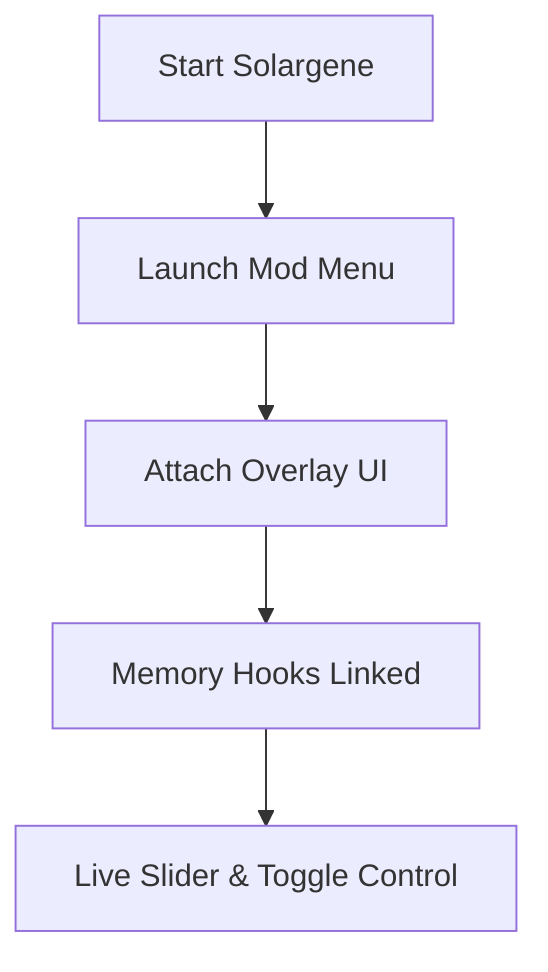

# Solargene Mod Menu — A Constellation of Switches at Your Fingertips

In **Solargene**, the universe speaks softly.
Energy flows, colonies mature, and decisions echo across quiet systems. It is beautiful — and sometimes, beautifully slow.

The **Solargene Mod Menu** is a **real-time control interface** that slips gently into that silence, offering you a panel of elegant toggles to shape time, matter, and motion. Not a blunt rewrite of rules, but a starmap of possibilities — one click at a time.

This is for players who want to *explore systems*, not wait for them.

---

## 🌌 Overview — A Living Menu for a Living System

Unlike classic trainers with rigid hotkeys, the Solargene Mod Menu provides a **visual in-game panel**. Every feature is grouped, labeled, and adjustable on the fly, turning complex mechanics into something almost musical.

What defines this mod menu:

* Clean, collapsible UI 🪐
* Real-time value sliders
* Independent feature modules
* Zero file modification

You don’t leave the game to control it. You stay inside the orbit.

---

## 🧩 Mod Menu Features — A Toolkit for Stellar Architects

### 🔋 Resource & Energy Controls

* Infinite or custom-set resources
* Lock energy production/consumption
* Instantly complete processing chains

Perfect for stress-testing megastructures or learning late-game balance.

---

### ⏳ Time & Simulation Layer

* Global simulation speed slider (0.25x–10x)
* One-click skip for long research timers
* Soft pause: freeze logic, free camera ✨

Time becomes clay — shaped, not endured.

---

### 🏗 Construction & Colony Management

* Instant building completion
* Ignore placement and adjacency limits
* Stabilize population, morale, or output

Design boldly across multiple systems without penalties.

---

### 🧭 Exploration & Vision Tools

* Reveal fog of war
* Unlock nearby star system visibility
* Persistent map awareness 🌠

Strategy sharpens when uncertainty fades.

---

## ⚙️ Setup — Opening the Panel

Installation is calm and predictable — like plotting a stable orbit.

### Quick Steps:

1. Launch Solargene and load your save
2. Run the Solargene Mod Menu executable as administrator
3. Press **Insert** to toggle the menu overlay
4. Adjust sliders, enable toggles, play freely

Example default bindings:

```text
Insert — Open / Close Mod Menu
Ctrl + Mouse — Adjust values
F5 — Save Menu Preset
```

All changes apply instantly, without restarting the simulation.

> [!IMPORTANT]
> Always open the mod menu **after** the game world is fully loaded to ensure stable hooks.

---

## 🔭 Under the Hood — How the Mod Menu Works



Each category operates independently, ensuring stability even during extended sessions.

---

## ❓ FAQ — Signals from Curious Explorers

### Is this safer than a classic trainer?

Yes. The visual menu reduces misclicks and makes every change explicit.

### Can I save my settings?

Absolutely. Presets let you switch between playstyles instantly.

### Does it affect performance?

The overlay is lightweight, with negligible CPU/GPU usage.

### Will updates break it?

The mod menu is maintained to stay compatible with new builds.

### Is this meant for beginners?

Yes — sliders invite learning, not mistakes.

---

## 🌠 Final Thoughts — Command Without Conquest

The **Solargene Mod Menu** is not about domination.
It is about *listening faster*, seeing clearer, and building without fear of wasted time.

Use it to:

* Prototype interstellar layouts
* Learn systems through experimentation
* Skip waiting when curiosity burns
* Or simply watch a galaxy unfold at your chosen tempo
